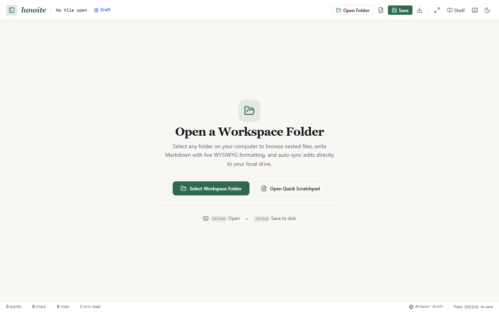
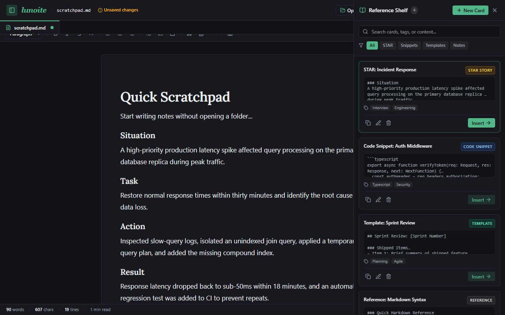
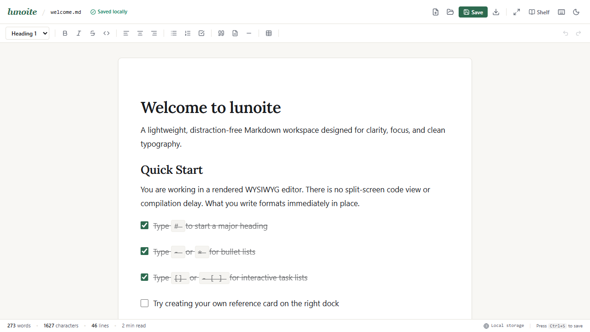
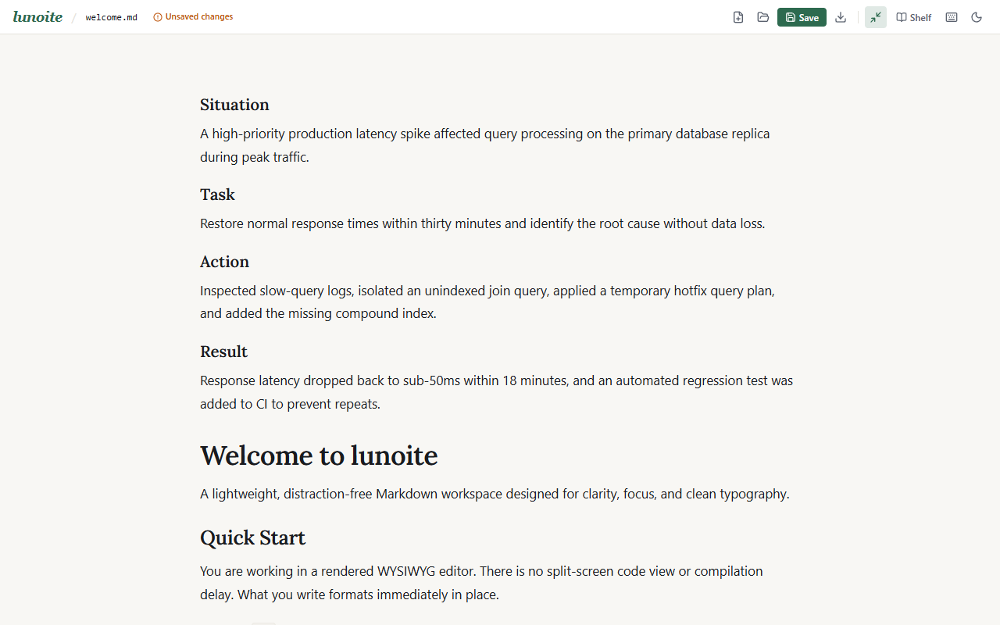
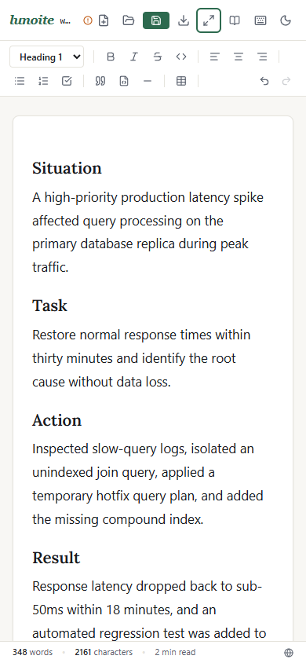

# lunoite

A lightweight, distraction-free Markdown desktop and web application designed for clarity, focus, and clean typography.

Unlike raw split-screen code editors, **lunoite** renders formatting inline in real time (similar to Typora or Notion). It connects directly to your local file system via the HTML5 File System Access API, allowing you to open an entire directory workspace, navigate a nested file tree, and auto-sync changes directly to files on disk without relying on browser storage.

---

## Visual Overview

### Workspace Welcome & Folder Selection
When launching lunoite without an active workspace, select any directory on your computer or jump into a quick scratchpad.



### Multi-Tab Editor Canvas & Obsidian Dark Theme
Open multiple files side by side in tabs. Changes auto-sync directly to your local disk with debounced writing.



### Daylight Paper Canvas
The editor centers documents on an off-white editorial paper sheet with an optimal line length of 65 to 75 characters per line.



### Lateral Reference Shelf
Keep snippets, interview STAR stories, meeting templates, and reference notes in a collapsible side drawer. Use the `Insert →` button to insert cards into the active tab at the cursor, or highlight text in the canvas and click `Clip to Card`.


### Zen Focus Mode
Press `Alt+Z` or click the maximize icon to tuck away the file explorer, tabs, toolbar, header chrome, and status bar for uninterrupted writing.



### Mobile Viewport
The interface reflows down to phone widths (tested at 390px) with zero horizontal scroll and comfortable tap targets.



---

## Core Capabilities

- **Folder & Workspace Navigation**: Open any folder on your computer (`window.showDirectoryPicker`). Browse files and nested directories in a collapsible file explorer.
- **Direct Disk Auto-Sync**: Edits are automatically saved directly to the file handle on disk (~800ms debounce after typing, tab switches, and `Ctrl+S`).
- **Multi-Document Tabs**: Open multiple `.md` documents simultaneously with dirty indicators (`●`) and quick tab switching.
- **Real-Time WYSIWYG Rendering**: Powered by Tiptap and ProseMirror. Typing `# `, `## `, `- `, `* `, or `[] ` converts immediately into headings, bullet lists, and interactive task checklists.
- **1:1 Markdown Serialization**: Bidirectional conversion between DOM nodes and standard Markdown strings via `tiptap-markdown`.
- **Lateral Card Shelf**: Eliminates vertical document clutter by providing side lanes for auxiliary notes, code snippets, and structured STAR stories.
- **Distraction-Free Zen Mode**: Single shortcut (`Alt+Z`) hides all interface controls, leaving only the writing surface.

---

## Tech Stack

- **Framework**: React 19 + TypeScript
- **Bundler**: Vite 6
- **Styling**: Tailwind CSS v4
- **Editor Engine**: `@tiptap/react` 3.31+, `@tiptap/starter-kit`, `@tiptap/extension-task-list`, `@tiptap/extension-table`, `tiptap-markdown`
- **File System**: HTML5 File System Access API + IndexedDB handle caching
- **Iconography**: Lucide React
- **Testing**: Playwright automated browser test suite

---

## Getting Started

### Prerequisites
- Node.js 18 or newer
- npm, pnpm, or yarn

### Installation

1. Clone the repository:
```bash
git clone https://github.com/your-username/lunoite.git
cd lunoite
```

2. Install dependencies:
```bash
npm install
```

3. Start the development server:
```bash
npm run dev
```
Open `http://localhost:5173` in your browser.

4. Build for production:
```bash
npm run build
```

---

## Keyboard Shortcuts & Triggers

| Action | Shortcut / Trigger | Description |
| :--- | :--- | :--- |
| **Open Workspace** | `Ctrl + O` | Selects a directory workspace from your local drive |
| **Save Document** | `Ctrl + S` | Immediately flushes edits directly to the active disk file |
| **Toggle File Explorer** | `Alt + E` | Opens or collapses the left workspace file explorer |
| **Toggle Shelf** | `Alt + S` | Opens or closes the lateral Reference Shelf |
| **Zen Mode** | `Alt + Z` | Toggles distraction-free focus mode |
| **Bold** | `Ctrl + B` or `**text**` | Toggles bold styling |
| **Italic** | `Ctrl + I` or `*text*` | Toggles italic styling |
| **Task Checklist** | `[] + Space` | Creates an interactive checkbox list |
| **Heading 1** | `# + Space` | Formats block as Heading 1 |
| **Heading 2** | `## + Space` | Formats block as Heading 2 |
| **Blockquote** | `> + Space` | Formats block as a quote |
| **Code Block** | ```` + Enter | Creates a syntax-highlighted code block |
| **Divider** | `--- + Enter` | Inserts a horizontal rule |

---

## Desktop App & Automated Releases

**lunoite** is packaged with **Tauri v2** for an ultra-lightweight native desktop experience (10-15 MB installer, ~30 MB RAM).

### Local Desktop Development
```bash
# Requires Rust toolchain (https://rustup.rs)
npx tauri dev
```

### Local Production Build
```bash
npx tauri build
```
Compiled installers will be placed in `src-tauri/target/release/bundle/`:
- Windows: `.exe` (NSIS setup installer) and `.msi`
- macOS: `.dmg` and `.app`
- Linux: `.deb` and `.AppImage`

### Automated GitHub Releases
Every Git version tag pushed to the repository automatically triggers the GitHub Actions release workflow:
```bash
git tag v1.0.0
git push origin v1.0.0
```
GitHub Actions compiles binaries for Windows, macOS (Universal Apple Silicon & Intel), and Linux (Ubuntu), and automatically publishes them to your repository's Releases page.

---

## License

MIT License. Feel free to use, modify, and distribute this application.
