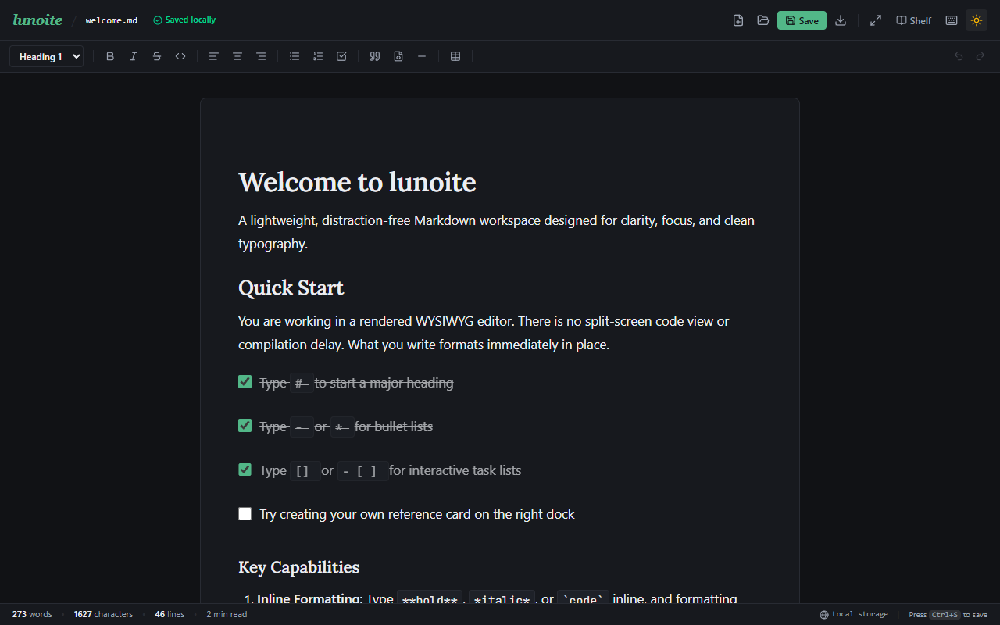
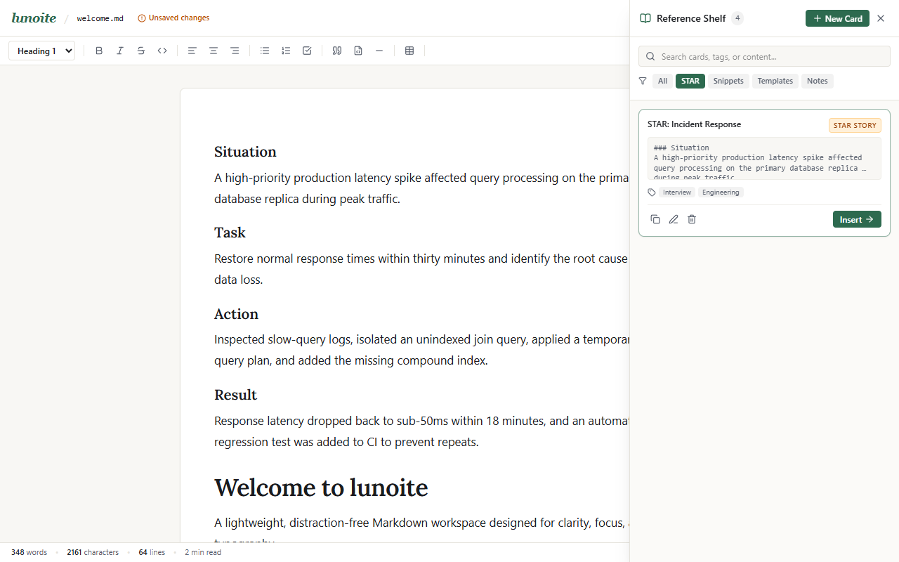
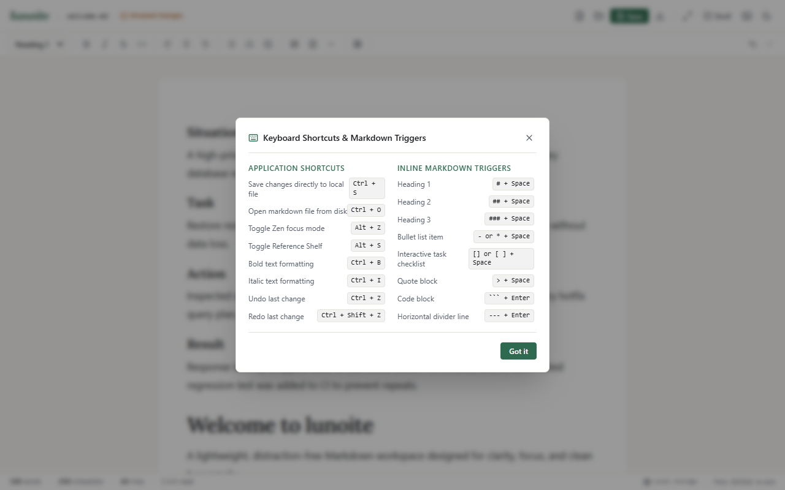

# lunoite

A lightweight, distraction-free Markdown desktop and web application designed for clarity, focus, and clean typography.

Unlike raw split-screen code editors, **lunoite** renders formatting inline in real time (similar to Typora or Notion). It connects directly to your local file system via the HTML5 File System Access API, allowing you to open and save standard `.md` files straight to disk with `Ctrl+S`.

---

## Visual Overview

### Daylight Paper Canvas
The editor centers the document on an off-white editorial paper sheet with an optimal line length of 65 to 75 characters per line.


### Obsidian Nocturne (Dark Mode)
A low-glare dark theme featuring an obsidian canvas (`#111215`), warm slate sheet (`#17191E`), and soft sage accents (`#52B788`). Text contrast exceeds 15.8:1, well above the WCAG AA minimum.



### Lateral Reference Shelf
Keep snippets, interview STAR stories, meeting templates, and reference notes in a collapsible side drawer. Use the `Insert →` button to insert cards into the document at the cursor, or highlight text in the canvas and click `Clip to Card`.



### Zen Focus Mode
Press `Alt+Z` or click the maximize icon to tuck away the toolbar, header chrome, and status bar for uninterrupted writing.


### Keyboard Shortcuts & Markdown Triggers
Access quick formatting commands and syntax triggers from the built-in guide.



### Mobile Viewport
The interface reflows down to phone widths (tested at 390px) with zero horizontal scroll and comfortable tap targets.


---

## Core Capabilities

- **Real-Time WYSIWYG Rendering**: Powered by Tiptap and ProseMirror. Typing `# `, `## `, `- `, `* `, or `[] ` converts immediately into headings, bullet lists, and interactive task checklists.
- **1:1 Markdown Serialization**: Bidirectional conversion between DOM nodes and standard Markdown strings via `tiptap-markdown`.
- **Direct Disk Synchronization**: Uses `window.showOpenFilePicker` and `showSaveFilePicker`. Edits are saved directly back to the active file on your hard drive with `Ctrl+S` (or `Cmd+S`).
- **Auto-Save Fallback**: Content is mirrored to browser `localStorage` continuously, so unsaved drafts are never lost on page refresh or browser restart.
- **Lateral Card Shelf**: Eliminates vertical document clutter by providing side lanes for auxiliary notes, code snippets, and structured STAR stories.
- **Distraction-Free Zen Mode**: Single shortcut (`Alt+Z`) hides all interface controls, leaving only the writing surface.

---

## Tech Stack

- **Framework**: React 19 + TypeScript
- **Bundler**: Vite 6
- **Styling**: Tailwind CSS v4
- **Editor Engine**: `@tiptap/react` 3.31+, `@tiptap/starter-kit`, `@tiptap/extension-task-list`, `@tiptap/extension-table`, `tiptap-markdown`
- **Iconography**: Lucide React
- **Testing**: Playwright automated browser test suite

---

## Getting Started

### Prerequisites
- Node.js 18 or newer
- npm, pnpm, or yarn

### Installation

1. Clone the repository:
```bash
git clone https://github.com/your-username/lunoite.git
cd lunoite
```

2. Install dependencies:
```bash
npm install
```

3. Start the development server:
```bash
npm run dev
```
Open `http://localhost:5173` in your browser.

4. Build for production:
```bash
npm run build
```

---

## Keyboard Shortcuts & Triggers

| Action | Shortcut / Trigger | Description |
| :--- | :--- | :--- |
| **Save Document** | `Ctrl + S` | Writes directly to the open local disk file |
| **Open File** | `Ctrl + O` | Opens native file picker for `.md` files |
| **Zen Mode** | `Alt + Z` | Toggles distraction-free focus mode |
| **Toggle Shelf** | `Alt + S` | Opens or closes the lateral Reference Shelf |
| **Bold** | `Ctrl + B` or `**text**` | Toggles bold styling |
| **Italic** | `Ctrl + I` or `*text*` | Toggles italic styling |
| **Task Checklist** | `[] + Space` | Creates an interactive checkbox list |
| **Heading 1** | `# + Space` | Formats block as Heading 1 |
| **Heading 2** | `## + Space` | Formats block as Heading 2 |
| **Blockquote** | `> + Space` | Formats block as a quote |
| **Code Block** | ```` + Enter | Creates a syntax-highlighted code block |
| **Divider** | `--- + Enter` | Inserts a horizontal rule |

---

## License

MIT License. Feel free to use, modify, and distribute this application.
